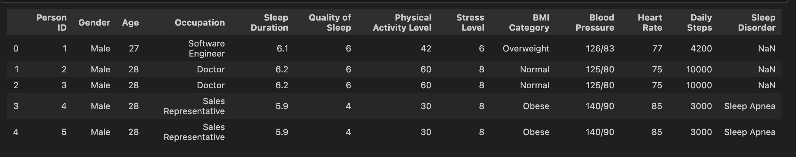
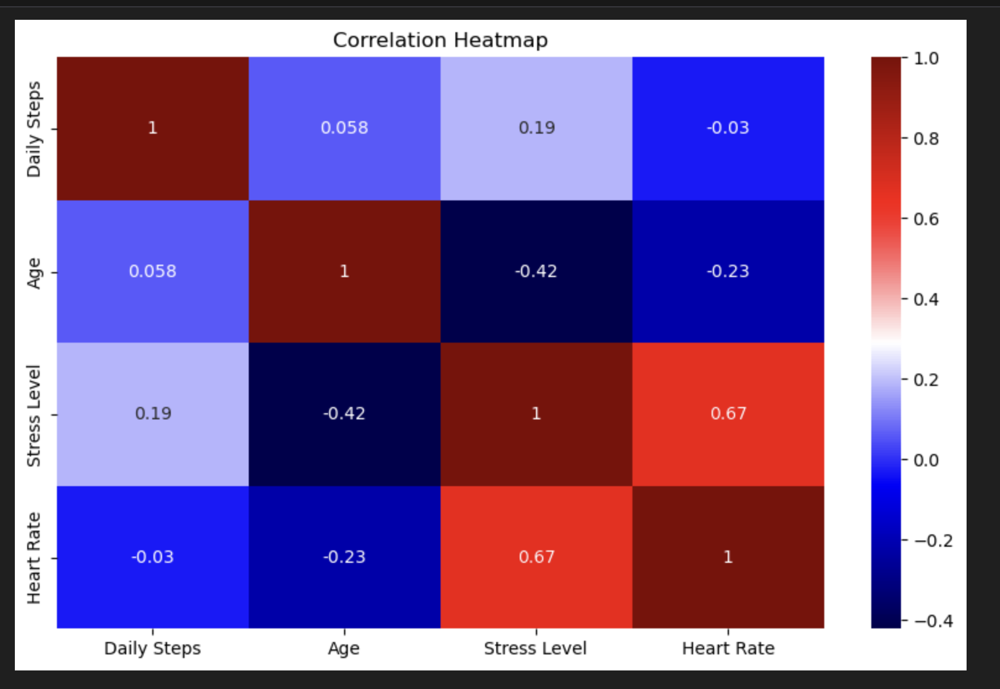
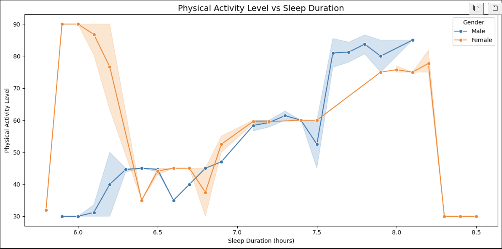
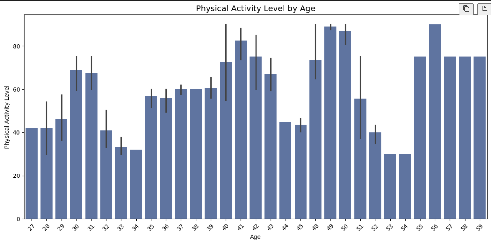
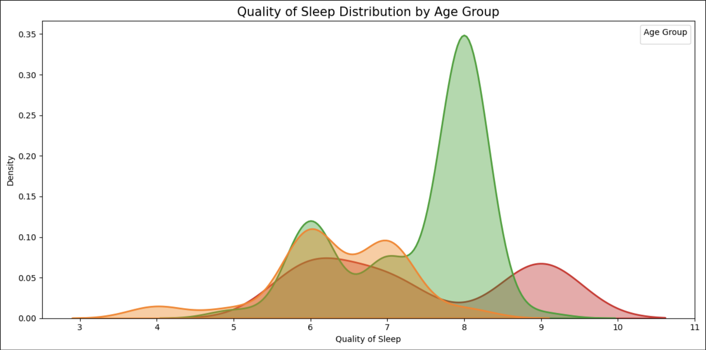
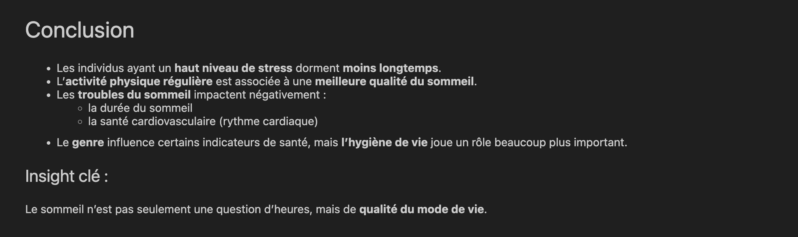

#  Sleep, Health & Lifestyle — Exploratory Data Analysis

This project explores how lifestyle habits, mental health, physical activity, and stress levels affect sleep duration and overall sleep quality.

##  Objective
Identify which behavioral and health-related variables have the strongest impact on sleep duration and sleep quality.

##  Dataset
- Source: https://www.kaggle.com/datasets/uom190346a/sleep-health-and-lifestyle-dataset
- Number of rows: ~400 individuals
- Key features:
  - Sleep Duration
  - Stress Level
  - Physical Activity Level
  - Heart Rate
  - Daily Steps
  - Sleep Disorder (None / Insomnia / Apnea)
  - BMI Category
  - Mental Health

##  Tools
- Python
- Pandas, NumPy
- Matplotlib, Seaborn
- Jupyter Notebook

##  Main Analysis
- Distribution of sleep duration across individuals
- Relationship between stress level and sleep duration
- Impact of physical activity on sleep quality
- Sleep disorders and their effect on sleep duration
- Correlation analysis between health and lifestyle metrics

##  Key Insights
- Individuals with **high stress levels** tend to **sleep less**.
- Higher **physical activity levels** correlate with **longer and better sleep**.
- **Sleep disorders** significantly reduce sleep duration.
- Lifestyle and emotional well-being have **more influence** on sleep quality than age or gender.

##  Project Structure
data/
notebooks/
outputs/graphs/
README.md
requirements.txt

# Résultats de l'Analyse et Visualisations
## Aperçu du dataset

  

## Heatmap des corrélations

  

## Activité physique selon la durée du sommeil

  

## Niveau d’activité physique par âge

  

## Distribution de la qualité du sommeil

  

## Conclusion & Insight

  

##  Author
**Iliass Gzouli**
